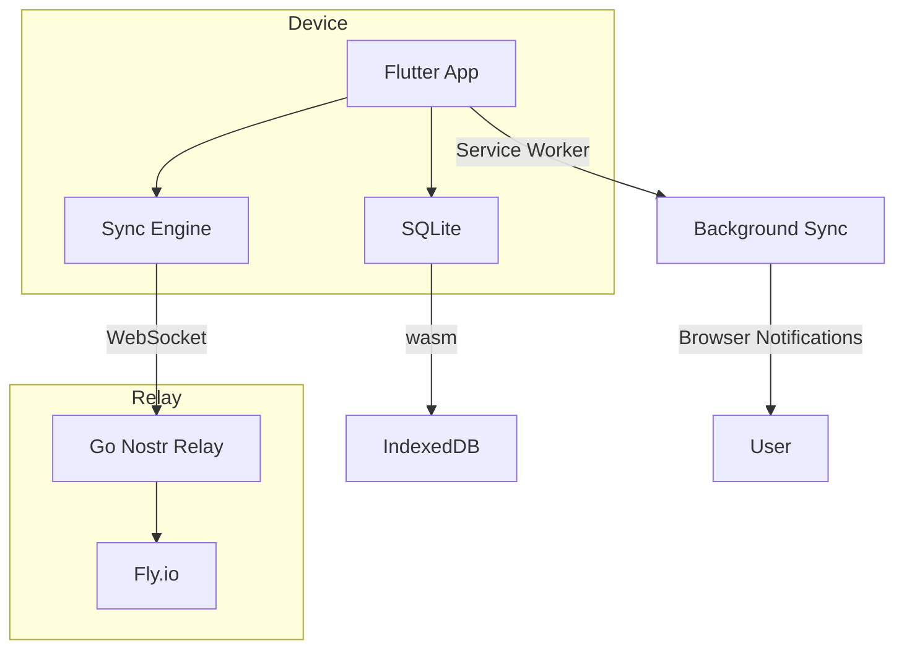

# FarmChore — Feature Overview

> Local-first chore management for small farms. No cloud vendor lock-in.

---

## Core

| Feature | What it does |
|---|---|
| **Role-based defaults** | Define chore sets per role (milker, pourer, feeder, mechanic, farmer). Each role gets its own defaults. |
| **Daily auto-generation** | Chores generate automatically each morning from defaults — no manual entry. |
| **Checklists** | Every chore has a step-by-step checklist. Mark items done as you go. |
| **Chore sets** | Save variant defaults (e.g. "Compressor down — icing") and swap them in instantly. |
| **Reorderable lists** | Drag to reorder. Priority order propagates to the morning meeting. |

## Scheduling & Escalation

| Feature | What it does |
|---|---|
| **Due times** | Set an optional due time on any chore (e.g. "Milking due at 6:00 AM"). |
| **Visual escalation** | Overdue chores go yellow → orange → red on the card. |
| **Role heads-up** | If a chore is overdue past the escalation threshold, the role team gets a heads-up. |
| **Farm-wide escalation** | If still overdue, the whole farm gets an alert. |
| **Dedup** | Each escalation is tagged — never posted twice. |

## Communication

| Feature | What it does |
|---|---|
| **Farm news** | Post farm-wide or role-scoped notices. |
| **Quick alerts** | One-tap urgent alerts with red styling — "Water pipe burst!" |
| **Farm messages** | Broadcast or DM to any member. |
| **Chore comments** | Comment on any chore instance — questions, notes, status. |
| **Morning meeting** | One screen: today's chores, assignments, unassigned, news. Ready to present. |

## Sync & Offline

| Feature | What it does |
|---|---|
| **Local-first** | SQLite on device. Works offline, no internet required. |
| **Nostr relay** | Events sync via a self-hosted relay. Full audit trail. |
| **Real-time** | Live WebSocket subscription — changes appear instantly across devices. |
| **Conflict-free** | Last-write-wins with deterministic ordering. No merge conflicts. |
| **QR join** | New members scan a QR code to connect — no account creation. |

## Admin

| Feature | What it does |
|---|---|
| **Defaults editor** | Edit description, checklist, schedule, escalation for any chore. |
| **Day off** | Mark a member as off — their chores skip automatically. |
| **Skills** | Tag members with skills. Chores can require specific skills. |
| **Key backup** | Export/import your Nostr identity key. |
| **Data purge** | Reset all data with confirmation. |

---

## Architecture

Built with Flutter + Go. No third-party SaaS. Your farm, your data.
