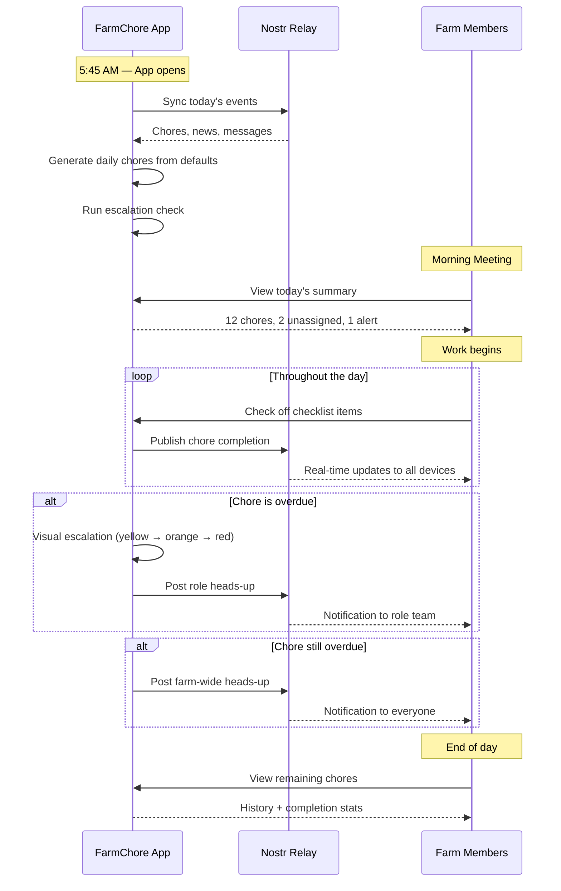
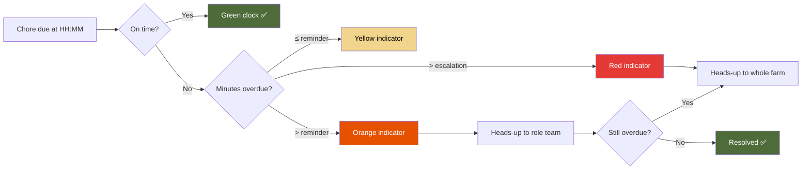
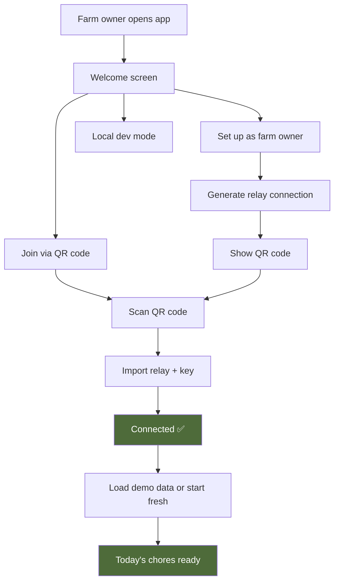

# FarmChore — Use Cases & Workflow

> How real farms use FarmChore every day.

---

## Use Cases

### 1. Morning milking shift
Milker opens the app at 5:45 AM. Today's chores are already generated. They see "Morning milking — due 6:00 AM" with a green clock. They tap to start, check off "Prep parlor," "Check cow ID," "Start milking." Done — swipe to complete. The pourer downstream sees it marked done.

### 2. Compressor goes down
Farm owner taps the red alert button. Types "Compressor down — use icing workflow." Hits send. Everyone on the pourer team gets an urgent heads-up instantly. Owner then swaps in the "Compressor down" chore set — the default pourer chores change to icing-specific tasks for the day.

### 3. New member onboarding
New farm hand scans a QR code on the owner's phone. They're connected to the relay instantly. Their name, role, and today's chores appear. No email, no password, no account creation.

### 4. Overdue escalation
"Feed pigs" was due at 7:00 AM. It's now 8:30 AM. The chore card is orange. At 9:00 AM (past the 60-min escalation threshold), a heads-up appears: "Feed pigs is 60min overdue. Assigned to someone — Feeders team, please check in." If still not done by 10:00 AM, the whole farm gets an alert.

### 5. Day off coverage
Feeder marks Thursday as their day off. On Thursday morning, "Feed chickens" shows as unassigned in the morning meeting. Another feeder sees it and self-assigns.

### 6. Morning meeting
Farm owner taps "Morning meeting" from the dashboard. One screen shows: 12 chores for today, 3 already done, 2 unassigned, 1 heads-up about the compressor. Ready to brief the team.

### 7. Comment on a chore
Pourer sees "Wash bottles" has a comment: "Out of sanitizer — pick some up from town." They reply in-app. The note is tied to that specific chore instance, not lost in a group chat.

---

## Daily Workflow

---

## Escalation Flow

---

## Onboarding Flow

